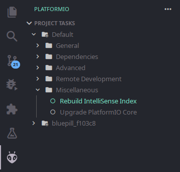
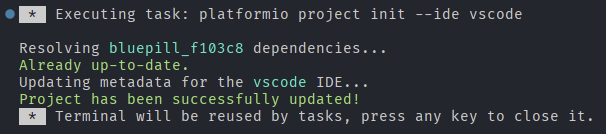

# Deskripsi

Repository ini memuat code komunikasi menggunakan CANBUS peripheral di STM32F103C8T6. Sebagian besar code digenerate menggunakan STM32CubeMX dan hak cipta dimiliki oleh STMicroelectronics. Untuk code yang tidak digenerate, lisensi terdapat pada file LICENSE.

# Memulai Pengembangan

Editor yang disarankan adalah Visual Studio Code (VSCode) dengan extensi PlatformIO

## Intellisense

Untuk mempermudah pengembangan, maka disarankan untuk membangun kembali index intellisense platformio. Hal ini akan menyalakan fitur autocomplete/intellisense. Hal ini terdapat pada menu extensi PlatformIO -> Project Task -> Default -> Miscellaneous -> Rebuild IntelliSense Index.

Jika sudah maka akan muncul tampilan kurang lebih seperti ini pada terminal:

## STM32CubeMX

Jika ingin melakukan perubahan dari STM32CubeMX, maka lakukan tahap berikut:

### Tools Dibutuhkan
- `stm32pio`

### Langkah
1. Buat perubahan menggunakan STM32CubeMX pada file `stm32canbus.ioc`
2. Pastika pada STM32CubeMX -> Project -> Toolchain/IDE yang dipilih adalah `Other Toolchains` atau `Makefile`
3. Simpan perubahan **tanpa** melakukan generate code
4. Sesuaikan pengaturan pada file `stm32pio.ini`, terutama untuk bagian `cubemx_cmd`
5. Jalankan perintah berikut dari terminal PlatformIO di directory project: `stm32pio generate`